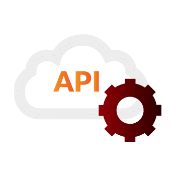
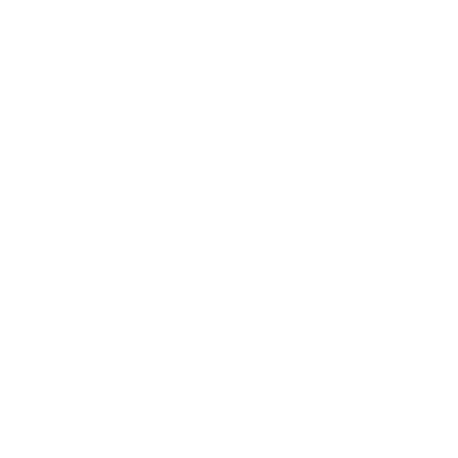
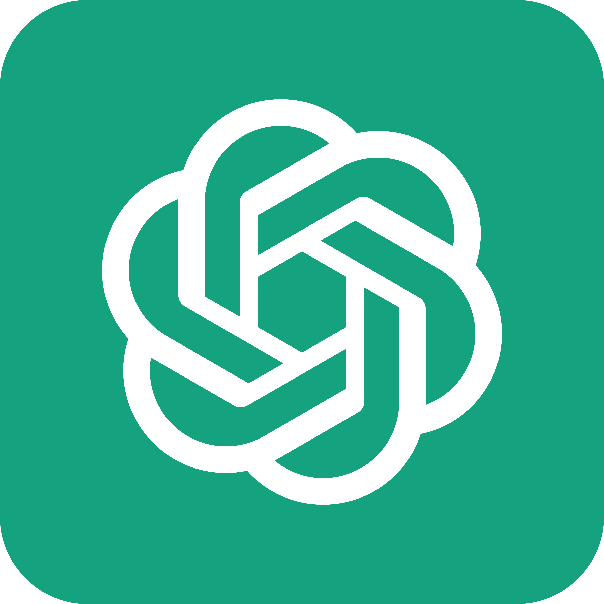
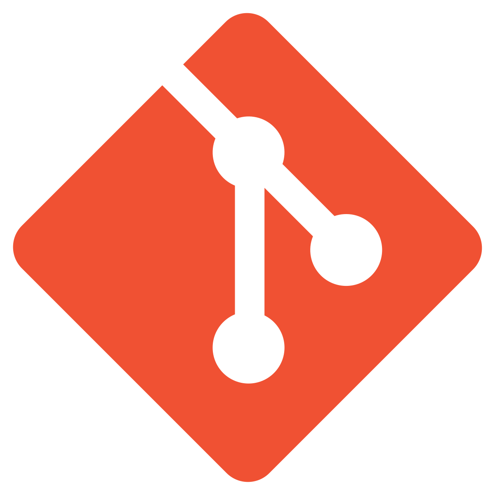

<!--  -->

  <picture>
    
  </picture>

  <b>Java Backend Engineer • 3 Years • Microservices &amp; Event-Driven Architecture</b>

  &nbsp;
  &nbsp;
  

---

  
  &nbsp;<b><ins>About Me</ins></b>

  

My name is Shubham Bhati and I am a Java Backend Engineer specializing in Spring Boot, microservices and event-driven architectures. I build high-throughput, enterprise-grade systems with 3+ years of experience.

<blockquote>
  <ul>
    <li>🔧 <b>Distributed Microservices:</b> Building scalable event-driven architectures utilizing Apache Kafka.</li>
    <li>⚡ <b>Performance Optimization:</b> Optimizing API latency and caching layers with Redis.</li>
    <li>🤖 <b>AI Integration:</b> Integrating OpenAI and Gemini APIs for backend automation pipelines.</li>
    <li>🚀 <b>Robust Delivery:</b> Architecting low-latency transactional platforms and secure REST APIs.</li>
  </ul>
</blockquote>

  
  &nbsp;<b><ins>Experience</ins></b>

  🔷 <b>MobilePe — Java Spring Boot Developer</b> 
  Fintech &amp; Payment Systems • Jun 2026 - Present • Noida, India

<blockquote>
  <ul>
    <li>🚀 <b>Event Streaming:</b> Engineered and optimized <b>Apache Kafka</b> async pipelines; successfully resolved production-level consumer lag issues by tuning thread and polling concurrency.</li>
    <li>⚡ <b>Latency Caching:</b> Designed <b>Redis cache handlers</b> and read-through caching engine structures for SOR checks to minimize primary DB load.</li>
    <li>🛡️ <b>Resource Isolation:</b> Configured a separate, dedicated database routing architecture (<b>Multi-Datasource Config</b>) to isolate heavy reporting exports from core transaction pools.</li>
    <li>🏗️ <b>Transaction Routing:</b> Designed a polymorphic transaction handler routing system supporting <b>20+ payment handler types</b> (ATM, Refund, PosReversal).</li>
  </ul>
</blockquote>

  🔷 <b>AlignBits LLC — Software Engineer</b> 
  Justransform iPaaS Platform • Sep 2024 - May 2026 • Dubai, UAE (Remote)

<blockquote>
  <ul>
    <li>🏗️ <b>Scale:</b> Designed transformation orchestration engines for logistics iPaaS pipelines handling REST, SFTP and AS2 data protocols across <b>10+ client pipelines</b>.</li>
    <li>🤖 <b>AI Automation:</b> Built OpenAI-powered pipeline for automated EDI/JSON validation — **reduced manual debugging by 30%**.</li>
    <li>⚡ <b>Reliability:</b> Resolved <b>15+ high-priority production incidents</b> through system debugging and root-cause analysis.</li>
    <li>📨 <b>Async Processing:</b> Leveraged AWS SQS and RabbitMQ for decoupling event-driven transaction processing at scale.</li>
    <li>🔐 <b>Security:</b> Migrated microservices from Java 11 to Java 17 and integrated OAuth 2.0 JWT Spring Security.</li>
  </ul>
</blockquote>

  🔷 <b>IHX Private Limited — Associate Software Engineer</b> 
  Healthcare Claims Processing • Jun 2023 - Aug 2024 • Bengaluru, India

<blockquote>
  <ul>
    <li>🏥 <b>Healthcare Backend:</b> Built JSON-to-FHIR data transformation engines processing high-frequency healthcare claim records.</li>
    <li>📈 <b>Query Optimization:</b> Optimized Hibernate ORM mappings and database index keys, improving query latency on core insurer endpoints.</li>
    <li>✅ <b>Validation Pipelines:</b> Developed multi-layer validation pipelines and custom exception-handling frameworks.</li>
  </ul>
</blockquote>

---

  🛠️ &nbsp;<b><ins>Tech Stack</ins></b>

<table align="center" style="border: none; background: transparent; width: 100%;">
  <tr align="center" style="background: transparent; border: none;">
    <td style="border: none; padding: 12px 8px; line-height: 1.4;"> Java</td>
    <td style="border: none; padding: 12px 8px; line-height: 1.4;"> Spring Boot</td>
    <td style="border: none; padding: 12px 8px; line-height: 1.4;"> Spring Security</td>
    <td style="border: none; padding: 12px 8px; line-height: 1.4;"> Hibernate</td>
    <td style="border: none; padding: 12px 8px; line-height: 1.4;"> REST APIs</td>
  </tr>
  <tr align="center" style="background: transparent; border: none;">
    <td style="border: none; padding: 12px 8px; line-height: 1.4;"> Apache Kafka</td>
    <td style="border: none; padding: 12px 8px; line-height: 1.4;"> Redis</td>
    <td style="border: none; padding: 12px 8px; line-height: 1.4;"> RabbitMQ</td>
    <td style="border: none; padding: 12px 8px; line-height: 1.4;"> AWS SQS</td>
    <td style="border: none; padding: 12px 8px; line-height: 1.4;"> PostgreSQL</td>
  </tr>
  <tr align="center" style="background: transparent; border: none;">
    <td style="border: none; padding: 12px 8px; line-height: 1.4;"> MySQL</td>
    <td style="border: none; padding: 12px 8px; line-height: 1.4;"> MongoDB</td>
    <td style="border: none; padding: 12px 8px; line-height: 1.4;"> OpenAI API</td>
    <td style="border: none; padding: 12px 8px; line-height: 1.4;"> Gemini API</td>
    <td style="border: none; padding: 12px 8px; line-height: 1.4;"> Docker</td>
  </tr>
  <tr align="center" style="background: transparent; border: none;">
    <td style="border: none; padding: 12px 8px; line-height: 1.4;"> Git</td>
    <td style="border: none; padding: 12px 8px; line-height: 1.4;"> JUnit 5</td>
    <td style="border: none; padding: 12px 8px; line-height: 1.4;"> Postman</td>
    <td style="border: none; padding: 12px 8px; line-height: 1.4;"> Python</td>
    <td style="border: none; padding: 12px 8px; line-height: 1.4;"> Bash</td>
  </tr>
</table>

---

  📊 &nbsp;<b><ins>GitHub Stats</ins></b>

  
    
  

---

  ✍️ &nbsp;<b><ins>Recent Blog Posts</ins></b>

<!-- BLOG-POST-LIST:START -->
<table align="center" width="100%">
  <thead>
    <tr>
      <th align="left" width="75%">📚 Article Title &amp; Focus</th>
      <th align="center" width="25%">📅 Date</th>
    </tr>
  </thead>
  <tbody>
    <tr>
      <td>🔷 <b><a href="https://shubhambhati.is-a.dev/posts/stop-letting-hikaricp-kill-your-cheap-vps">Stop Letting HikariCP Kill Your Cheap VPS</a></b> <code>HikariCP</code> <code>JVM Optimization</code></td>
      <td align="center">2026-07-11</td>
    </tr>
    <tr>
      <td>🔷 <b><a href="https://shubhambhati.is-a.dev/posts/spring-boot-validation-don-t-reinvent-the-wheel">Spring Boot Validation: Don't Reinvent the Wheel</a></b> <code>Validation</code> <code>REST API</code></td>
      <td align="center">2026-07-11</td>
    </tr>
    <tr>
      <td>🔷 <b><a href="https://shubhambhati.is-a.dev/posts/stop-manual-json-parsing-in-spring-boot">Stop Manual JSON Parsing in Spring Boot</a></b> <code>Jackson</code> <code>JSON Deserialization</code></td>
      <td align="center">2026-07-11</td>
    </tr>
    <tr>
      <td>🔷 <b><a href="https://shubhambhati.is-a.dev/posts/spring-boot-database-connection-pooling">Spring Boot Database Connection Pooling</a></b> <code>HikariCP</code> <code>PostgreSQL</code></td>
      <td align="center">2026-07-10</td>
    </tr>
    <tr>
      <td>🔷 <b><a href="https://shubhambhati.is-a.dev/posts/smarter-environment-specific-beans">Smarter Environment-Specific Beans</a></b> <code>Spring Profiles</code> <code>Configuration</code></td>
      <td align="center">2026-07-09</td>
    </tr>
  </tbody>
</table>
<!-- BLOG-POST-LIST:END -->

---

  📬 &nbsp;<b><ins>Let's Connect</ins></b>

<table style="border-collapse: collapse; border: 1.5px solid #1e293b; border-radius: 12px; background-color: #0b0f19; width: 100%; max-width: 580px; box-shadow: 0 10px 30px rgba(0,0,0,0.55);">
<tr>
<td style="padding: 24px; text-align: center;">
<h3 style="margin-top: 0; margin-bottom: 12px; color: #38bdf8; font-size: 22px; font-weight: 600;">Let's Collaborate!</h3>

Reach out to discuss backend scalability, event-driven payment flows, database performance tuning or open-source opportunities.

  &nbsp;&nbsp;
  &nbsp;&nbsp;
  
    
  &nbsp;&nbsp;
  &nbsp;&nbsp;
  
    
  &nbsp;&nbsp;
  

</td>
</tr>
</table>

---

  
  

  

